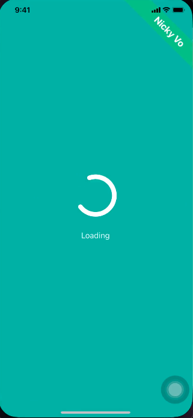
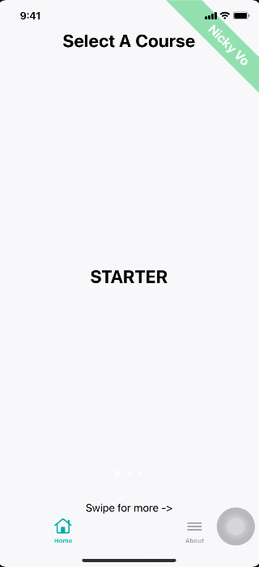
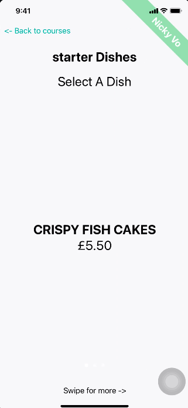
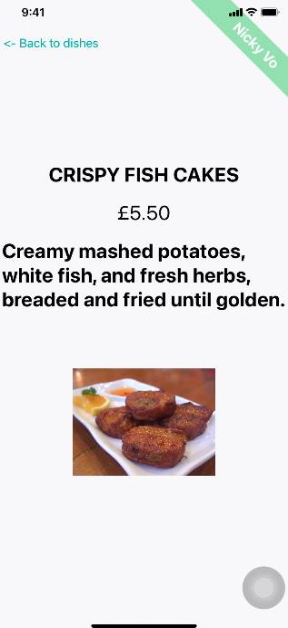
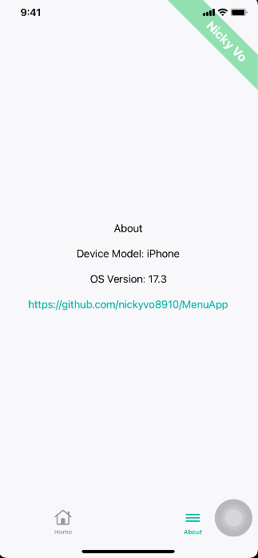

# MenuApp

## Project Overview

MenuApp is an iOS application built using SwiftUI and a coordinator-based architecture. It displays a menu fetched from a REST API, grouping items by category, and allows viewing detailed information including images for each menu item.

## Architecture

- **SwiftUI** for declarative UI  
- **Coordinator Pattern** for navigation flow and screen management  
- **MVVM** pattern for clean separation of concerns  
- **Dependency Injection** with Factory  
- **Async/Await** for network operations 

The code adheres to SOLID principles aiming for maintainability and clarity.

## Dependencies
- AlamoFire
- MijickPopups
- swift-format
- Factory

## Features

- Fetch menu items and detail data from API endpoints  
- Category carousel with intuitive horizontal scrolling  
- Menu item list filtered by selected category  
- Detailed item view with async image loading  
- Robust error handling and user-friendly loading states  
- Unit tests cover key data and view model functions  

## Setup Instructions

1. Clone the repo
2. Open the project in Xcode (version 15.0 or later).

3. Build and run on the iOS Simulator or a physical device.

4. Dependencies are managed via Swift Package Manager and included automatically.

## Running Tests

In Xcode, press `Cmd+U` or go to Product > Test to run the unit tests.

## Usage

- Select categories through the top carousel to filter menu items.  
- Tap a menu item to view detailed information including images.  
- Navigation back buttons appear automatically for smooth user navigation.

## Known Limitations and Future Enhancements

- Image caching for better performance.  
- More comprehensive error UI states.  
- Offline mode with persistent cache.
- UI refinements and animations.
- Invalid JSON reponse UI handlings (Mushroom & Spinach Pie, Beer-Battered Onion Rings, Chocolate Brownie Sundae)

## Contact

Created by Nicky Vo.

## Screenshots
Loading View

Category View - Select A Course

Menu View - Select A Dish

Dish Details View

About View

